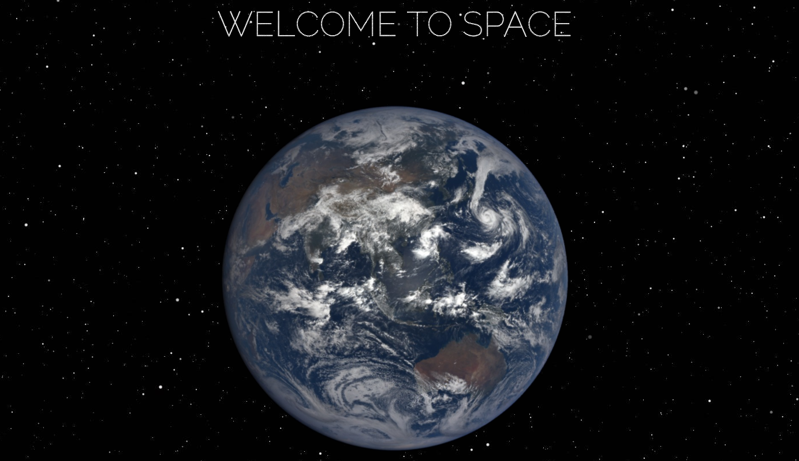
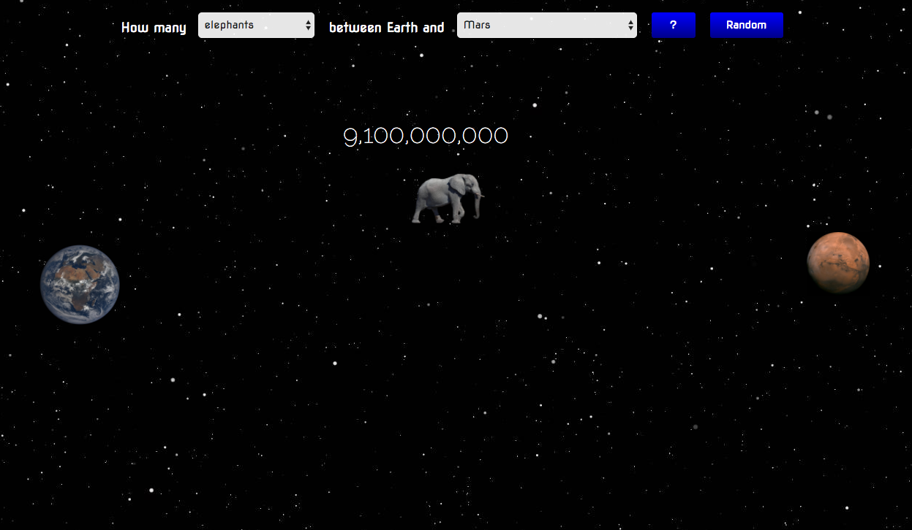
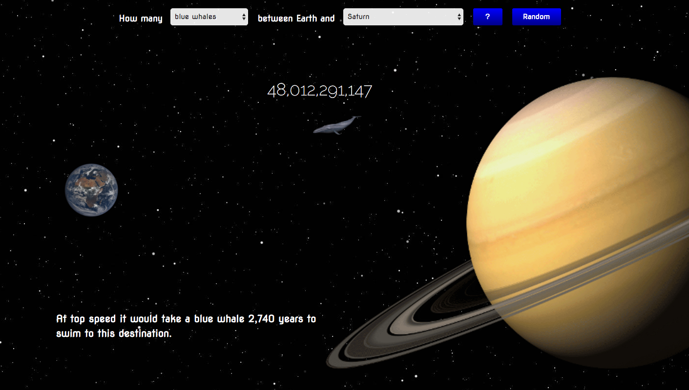
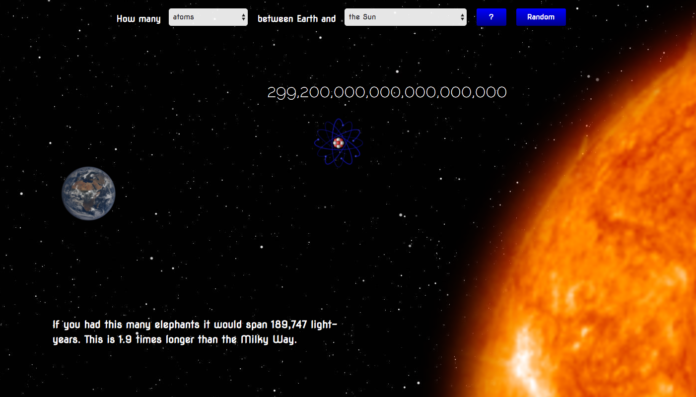
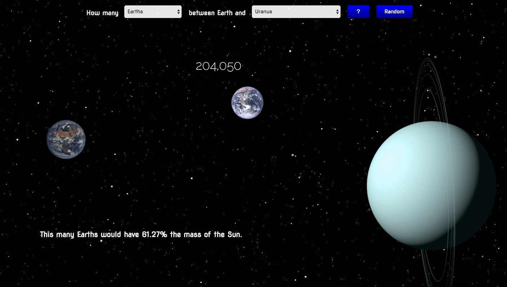

# Elephants to Mars
Elephants to Mars is a visualization tool for grasping the size of the Universe. We all know space is big, but how big is it? Time to wrap your head around the vastness of the cosmos.

## Try it for yourself
https://elephants-to-mars.firebaseapp.com/

## Screenshots

Welcome Homepage

How many elephants between Earth and Mars?

Change your object and your destination.

Did you notice the awesome fact in the bottom left?

The object can even be planets!

## Watch a walkthrough video

https://youtu.be/u24Z_NQafyY

## Features

- Choose from several objects and destinations.
- Press the "Random" button to display random object and destination to view.
- Enjoy Elephants to Mars on your mobile device!
- Discover several different facts relating to the selections you make.
- The welcome screen displays the most recent images of Earth taken by the NASA EPIC camera onboard the NOAA DSCOVR spacecraft.
API:https://epic.gsfc.nasa.gov/api/

- Expand your mind as you realize how big the cosmos really is!
